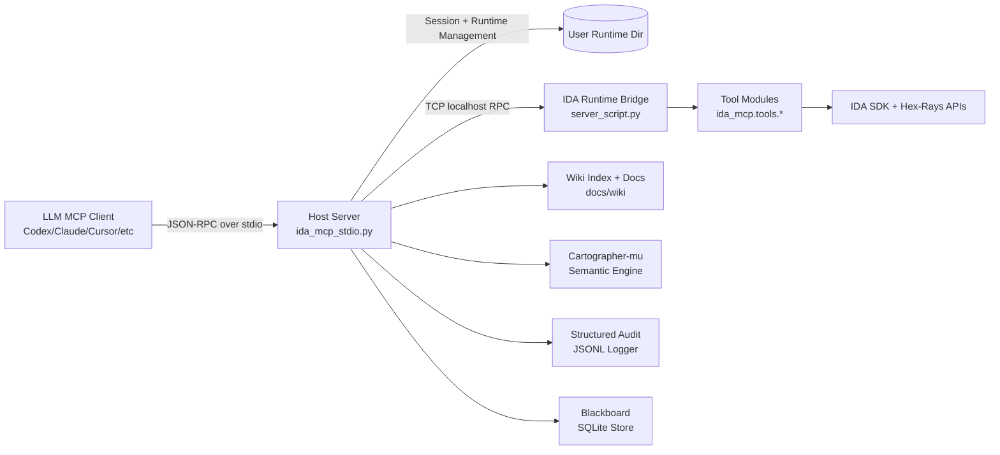
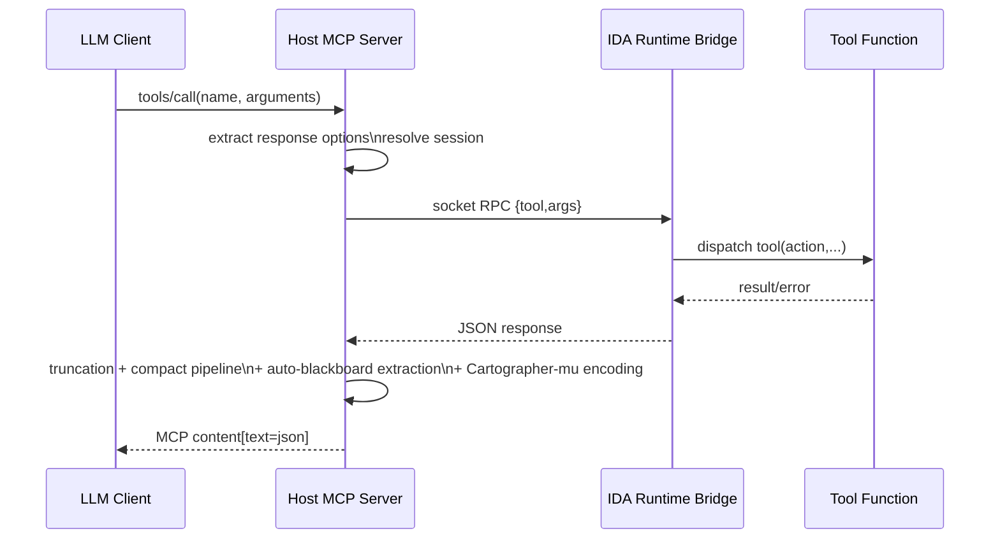
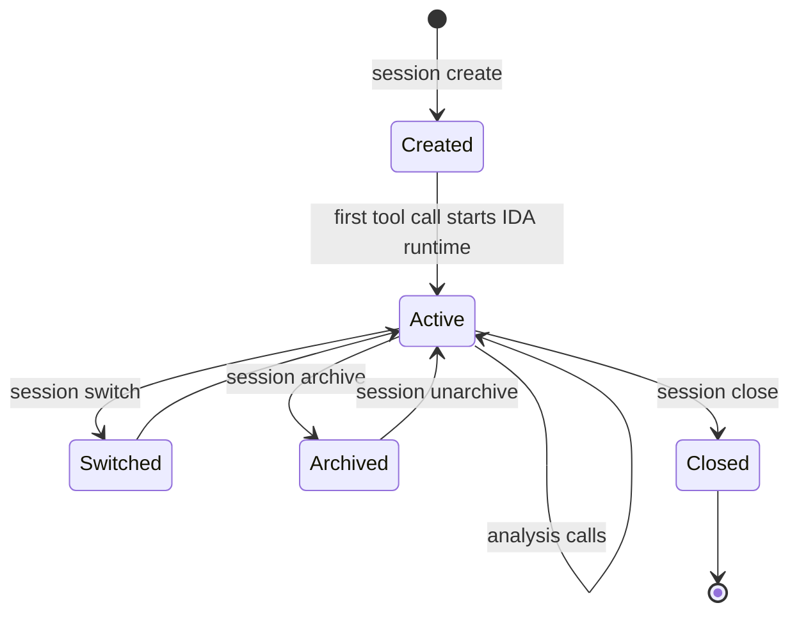

# IDA Pro MCP

> **⚠️ Work in Progress** — This project is under active development. APIs, tools,
> configuration, and documentation may change without notice. Breaking changes
> between commits are the norm. Test coverage is strongest in the host-side
> services and tool-surface layers; integration tests require IDA Pro and are
> run separately. Proceed accordingly.

Deterministic and ML-powered reverse engineering for IDA Pro via the Model Context Protocol (MCP).

`ida-pro-mcp` exposes IDA analysis, decompilation, debugging, triage, and annotation as structured MCP tools so coding agents can operate on binaries with deterministic calls instead of fragile text scraping.

## Table of Contents

- [What This Project Is](#what-this-project-is)
- [Why LLM Agents Use It](#why-llm-agents-use-it)
- [Requirements](#requirements)
- [Install](#install)
- [Documentation Map](#documentation-map)
- [Skillized Tool Catalog](#skillized-tool-catalog)
- [Quick Start](#quick-start)
- [How LLMs Should Use It](#how-llms-should-use-it)
- [Tool Surface](#tool-surface)
- [Local ML Components](#local-ml-components)
- [Bootstrap Control Loop](#bootstrap-control-loop)
- [Production Hardening](#production-hardening)
- [Auto-Blackboard and Context Injection](#auto-blackboard-and-context-injection)
- [Predictive Prefetching & Speculative Emulation](#predictive-prefetching--speculative-emulation)
- [Session Management](#session-management)
- [Guardrails](#guardrails)
- [Architecture Graphs](#architecture-graphs)
- [Technical Deep Dive](#technical-deep-dive)
- [Linux Support Details](#linux-support-details)
- [Response And Context Controls](#response-and-context-controls)
- [Troubleshooting](#troubleshooting)
- [Development](#development)
- [Contributing](#contributing)
- [License](#license)

## What This Project Is

`ida-pro-mcp` is a session-oriented MCP server built for IDA Pro 9.2+.

It provides:

- A host MCP server (`ida_mcp_stdio.py`) that LLM clients talk to via JSON-RPC over stdio
- A runtime bridge inside IDA (`src/ida_pro_mcp/server_script.py`) communicating over local TCP
- Canonical tools under `src/ida_pro_mcp/ida_mcp/tools/` with backward-compatible aliases (count is generated from schema metadata)
- A local ML engine (bge-code-v1 embeddings + BehaviorClassifier) for semantic search, label propagation, and frontier scoring
- A full bootstrap evidence control loop in `session` actions (calibration, drift, mitigation, adaptation, readiness)
- Structured audit logging, token-bucket rate limiting, and blackboard auto-pruning
- Guardrail layer for safe writes: strict write mode, address lockstep validation, pointer safety notes
- Persistent session/bookmark metadata in user runtime directory (`IDA_MCP_CACHE_DIR` or OS default)
- Built-in wiki docs accessible through the `wiki` tool

Important architecture note:

- This project does **not** run any backend cloud LLM service.
- Tool execution is deterministic IDA SDK logic plus local ML components (bge-code-v1 embeddings, BehaviorClassifier, FrontierEngine).
- Any LLM behavior comes from the MCP client using this server, not from an embedded server-side LLM runtime.

## Local Semantic Memory

`ida-pro-mcp` can build a local semantic index of decompiled functions using
`bge-code-v1` via `llama-server`, with a deterministic fallback when the model
is unavailable.

This enables behavior triage, similar-function search, and evidence-backed
context injection without sending code to a remote API.

Quick checks:

```bash
python install.py --embedder-doctor
ida-pro-mcp-cli tool agent '{"action":"intelligence_status"}'
python -m ida_pro_mcp.capsule.cli semantic-summary project.sideband --json
```

MCP demo workflow:

1. `session(action="create", binary_path="/abs/path/to/binary")`
2. `code(action="decompile", addr="0x401000")`
3. `agent(action="classify_function", addr="0x401000")`
4. `agent(action="similar_functions", addr="0x401000")`
5. `blackboard(action="write", title="finding", content="...")`
6. `agent(action="evidence_card", addr="0x401000")`
7. `python -m ida_pro_mcp.capsule.cli semantic-summary project.sideband --json`

## Why LLM Agents Use It

Without MCP, an LLM has to infer analysis state from screenshots, logs, and pasted snippets.
With `ida-pro-mcp`, an LLM can:

- Open and reuse long-lived analysis sessions
- Query exact symbols, xrefs, decompilation, CFG, imports, strings, types
- Perform edits (rename/comment/patch/type changes) reproducibly
- Batch operations to reduce round trips
- Receive compact-by-default responses to preserve context window
- Persist findings to a blackboard that survives context window resets
- Track hypotheses and maintain an analysis notebook

## Requirements

- IDA Pro 9.2+
- Python 3.11+
- `uv` recommended (installer supports fallback without `uv`)

## Install

### One-command installer (recommended)

```bash
python install.py
```

Default behavior is interactive on a real terminal (wizard mode). Use `--yes` for fully non-interactive automation.

Installer behavior:

1. Creates a runtime venv in a stable install directory (no repo copy/migration).
2. Installs the MCP runtime from package source (`--runtime-source auto|local|pypi`).
3. Auto-detects IDA install path (`IDADIR` / `IDA_MCP_IDAT` fallback logic included).
4. Configures supported MCP clients with backup files before mutation.
5. Installs Codex skills into `CODEX_HOME/skills` (default `~/.codex/skills`) using `router` mode by default.
6. Writes a structured install report to `<install-root>/install-report.json`.
7. Does not kill IDA processes unless explicitly requested via `--kill-ida`.
8. Does not modify shell startup files unless explicitly requested via `--install-cli-shim`.

Default install directory:

- Windows: `%LOCALAPPDATA%/ida-pro-mcp`
- Linux/macOS: `~/.local/share/ida-pro-mcp`

### PyPI install

```bash
pip install ida-pro-mcp
```

### Development install

```bash
git clone https://github.com/GrecAndrei/ida-pro-mcp.git
cd ida-pro-mcp
pip install -e .
```

### Supported MCP clients auto-configured by installer

- Gemini CLI
- Antigravity
- Claude Code
- Codex
- Copilot CLI
- OpenCode
- Claude Desktop
- Cursor
- VS Code (Copilot MCP config)
- Windsurf
- Cline
- Roo Code

### Manual run (for development)

```bash
python -u -m ida_pro_mcp.server
```

### CLI command

The installer also exposes a dedicated shell command for scripted use:

```bash
ida-pro-mcp-cli tool session '{"action":"status"}'
ida-pro-mcp-cli rpc tools/list '{}'
ida-pro-mcp-cli raw '{"jsonrpc":"2.0","id":1,"method":"tools/list","params":{}}'
```

If the console script is not yet installed, the bashrc function falls back to `python -m ida_pro_mcp.cli`.

## Documentation Map

Primary documentation now lives under `docs/`:

- `docs/README.md`: entry point for docs organization.
- `docs/wiki/`: wiki content used by the `wiki` MCP tool.
- `docs/TECHNICAL_REFERENCE.md`: low-level technical details.
- `docs/TOOLS_REFERENCE.md`: tool-focused reference.
- `docs/design/CAPSULES.md`: experimental Sideband capsule architecture and trust model.
- `ARCHITECTURE.md`: high-level boundaries and module ownership map.
- `CONTRIBUTING.md`: contribution workflow, guardrails, and PR expectations.

Legacy/superseded notes were moved to `docs/legacy/` to keep repo root clean.

## Skillized Tool Catalog

To reduce prompt/context churn from large tool metadata blocks, this repo uses a router-plus-docs layout:

- Root: `.agents/skills/`
- Router skill (only skill by default): `.agents/skills/ida-tool-router/SKILL.md`
- Per-tool docs (loaded on demand): `.agents/tool-docs/ida-tool-<tool>.md`

Installer skill modes:

- `router` (default): install only `ida-tool-router` (best for context efficiency)
- `full`: install every skill directory under `.agents/skills`
- `none`: skip Codex skill installation

Installer safety flags:

- `--dry-run`: plan only, no writes
- `--rollback-on-fail`: restore backed-up config files if install fails
- `--kill-ida`: explicitly stop IDA/IDAT before runtime setup
- `--install-cli-shim`: explicitly add CLI PATH shim to `~/.bashrc`
- `--interactive` / `--no-interactive`: force or disable wizard mode
- `--embed-model <path>`: explicitly set `bge-code-v1` GGUF model path
- `--embed-server-bin <path>`: explicitly set `llama-server` path
- `--install-llama-server`: auto-download and install `llama-server` when embedding model is enabled/found and no server binary is available
- `--no-embed-auto`: disable automatic embedder/server discovery
- `--capsule <file.sideband>`: write installer metadata/audit events into a capsule

Regenerate after tool metadata changes:

```bash
python3 scripts/generate_tool_skills.py
```

Source of truth for generation: `src/ida_pro_mcp/host/schemas_data.py`:
- `TOOLS`
- `TOOL_DESCRIPTIONS`
- `TOOL_ACTIONS`
- `TOOL_ARG_SCHEMAS`

Generated tool docs/skills are regenerated from this source and checked in CI for drift.

## Quick Start

### 1) Start server

Use installer-managed client config, or run manually:

```bash
python -u -m ida_pro_mcp.server
```

### 2) Create a session

From your MCP client:

```json
{
  "name": "session",
  "arguments": {
    "action": "create",
    "binary_path": "/path/to/binary"
  }
}
```

### 3) Call tools without repeating `idb`

IDB is **not required** to run MCP. Once a session is active, most tools automatically use current session context.
If you pass `idb`, it can be a session ID (`AB12CD34`), a `SID_*` IDB identifier/name, a binary path, or a full IDB path.

```json
{
  "name": "data",
  "arguments": {
    "action": "functions",
    "count": 50
  }
}
```

### 4) Use batch for multi-step flows

```json
{
  "name": "batch",
  "arguments": {
    "calls": [
      {"name": "idb", "arguments": {"action": "meta"}},
      {"name": "data", "arguments": {"action": "imports"}},
      {"name": "search", "arguments": {"action": "strings", "pattern": "http"}}
    ]
  }
}
```

Shorthand is also supported to reduce bracket noise:

```json
{
  "name": "batch",
  "arguments": {
    "calls": [
      "idb:meta",
      {"name": "data", "action": "imports"},
      {"tool": "search", "action": "strings", "pattern": "http"}
    ]
  }
}
```

## How LLMs Should Use It

Recommended operating pattern for agents:

1. `session(action="create"|"switch")`
2. `idb(action="meta")` for initial grounding
3. `data/code/search` for discovery
4. `summarize/agent/classify` for high-level synthesis
5. `modify/edit/bulk` for controlled updates
6. `bookmarks/wiki` for durable notes and in-tool docs

Practical agent rules:

- Prefer compact results, then zoom in with filters.
- Use `batch` when the next calls are deterministic.
- Paginate large result sets with tool-level `offset`/`count`.
- Use `truncation(action="continue")` only when needed.
- Save milestones via bookmarks, blackboard entries, and session notes.

## Tool Surface

## Bootstrap Control Loop

The `session` tool now includes a complete bootstrap evidence control loop designed for cold-start calibration and long-run governance:

- Calibration core: `bootstrap_init`, `bootstrap_run_tournament`, `bootstrap_compute_blend`
- Runtime outcomes: `bootstrap_ingest_outcome`, dispute lifecycle (`open/list/resolve`)
- Observability: `bootstrap_summary`, `bootstrap_summary_detailed`, `bootstrap_calibration_report`
- Drift and gating: snapshots, baseline update, alert evaluation, readiness gate/trend/guard
- Closed-loop control: mitigation planning/apply, effectiveness scoring, policy reweight, autopilot safeguards
- Finalization: `bootstrap_plan_status` and `bootstrap_finalize_report` for one-shot implementation + runtime readiness state

### Canonical vs compatibility tool names

The server keeps a **canonical** tool surface and preserves compatibility aliases for older clients.

- Canonical tool names are listed in `src/ida_pro_mcp/host/schemas_data.py` under `TOOLS`, and re-exported by `schemas.py`.
- Compatibility aliases are listed under `TOOL_ALIASES` and resolve before dispatch.
- Alias names are not advertised in `tools/list` unless intentionally promoted.

Current aliases:

- `plugins` -> `misc` (`misc(action="plugin_list"|"plugin_run")`)
- `xfer_analysis` -> `xref_analysis`

The advertised `tools/list` surface is intentionally wiki-first for limited context windows.
Default mode is `ultra`: short routing hints plus action enums. Use `tools/list` with `mode="lean"` or `mode="full"` only when a client truly needs richer schemas.
Additional specialized capabilities remain accessible via hub tools + wiki docs.

- Core/session: `session`, `batch`, `bookmarks`, `wiki`, `truncation`
- Data access: `idb`, `data`, `code`, `search`, `types`, `memory`, `query`
- Editing: `modify`, `funcs`, `segments`, `bulk`, `annotation`
- Analysis: `cfg_analysis`, `xref_analysis`, `stack_analysis`, `abi`, `protocol`, `classify`, `compare`, `summarize`, `agent`
- Security RE: `threat_hunt`, `taint`, `gadgets`, `deobfuscate`, `crypto_id`, `yara_hunt`
- Debug/trace: `debug`, `trace`, `trace_analysis`, `coverage`
- Structural: `ctree`, `microcode`, `graph`, `imports_deep`, `symbols`, `patterns`
- Utilities: `analysis`, `project`, `export`, `history`, `misc`, `calc`, `llm_helpers`, `binary_info`, `string_ops`
- Infrastructure: `blackboard`, `governance`, `filter`

For detailed per-tool docs, use the `wiki` tool or browse `docs/wiki/tools/`.

### Large Deterministic Action Surface

Each tool exposes multiple actions. The whole surface provides hundreds of deterministic operations across decompilation, cross-referencing, pattern matching, vulnerability scanning, and embedding-driven frontier analysis. Agents should not ingest the whole surface into prompt context. Start with `llm_helpers(action="bootstrap")`, `wiki(action="index")`, or filtered `tools/list` calls, then load only the relevant tool docs.

## Local ML Components

All ML is local and runs without any backend LLM service.

### bge-code-v1 Embeddings

The primary ML component. Runs via llama-server with the `bge-code-v1-q8_0.gguf` model. Produces 1536-dim float vectors from pseudocode/function signatures.

Used by:
- `search(action='nl')` — natural language search by cosine similarity
- `funcs(action='suggest_names')` — rename unnamed functions by similarity to named ones
- `funcs(action='find_similar')` — find structurally similar functions
- `FrontierEngine` — cluster all functions and score the analysis frontier
- `blackboard(action='search')` — semantic search over blackboard entries

### BehaviorClassifier

Zero-shot RE behavior detection using embedding similarity to labeled examples. Classifies pseudocode into behavior tags: `crypto_symmetric`, `network_http`, `process_injection`, `anti_analysis`, `persistence`, `credential_access`, etc.

Used by:
- `classify(action='function')` and `classify(action='all_functions')`
- `search(action='behavior')` — find all functions matching a behavior tag
- `llm_helpers(action='behavioral_signature_search')` — precise behavior search
- `llm_helpers(action='function_role_classifier')` — architectural role classification
- `string_ops(action='score_c2')` — malware family identification
- `smart_decompile` — behavior_tags in every decompile response

### FrontierEngine

Embedding-driven analysis guidance (`host/frontier.py`). Answers "what should I analyze next?".

- **Cluster**: k-means over all indexed embeddings → structural map of the binary
- **Propagate**: LLM labels one function → engine propagates to cluster neighbors (cosine ≥ 0.82, confidence decay 0.75)
- **Score**: ranks unvisited functions by proximity to labeled functions + xref count + entropy + cluster coverage
- **Contradict**: detects same-cluster functions with different LLM labels

Runs automatically every 180s in the analysis engine. Accessible via `blackboard(action='frontier')` and `ida://blackboard/frontier`.

### UsageIntelligence

Passive observer that mines audit logs and learns from real usage patterns (`host/usage_intelligence.py`).

- **SequenceModel**: Markov chain over (tool, action) pairs — predicts what the LLM will call next
- **EffectivenessModel**: EMA scoring by productive outcome — ranks suggestions by historical effectiveness
- **DriftDetector**: detects LOOP, ANALYZE_WITHOUT_RECORD, REPEATED_ADDR, HIGH_ERROR_RATE signals

Powers the `_nudge` field in every response.

### Additional ML components

- `bridge_search`: Multi-hop bridge query expansion for discovering indirect relationships
- `predictor`: Deterministic prediction and strategy suggestion

## Production Hardening

### Structured audit logging

Every tool call is logged as JSONL to `<cache_dir>/audit/YYYY-MM/audit_YYYY-MM-DD.jsonl`. Each record captures:

- Tool name, action, arguments
- Timestamp, duration, result shape
- Guardrail mode and warnings
- Session and process context

Logs rotate daily and are pruned when total size exceeds a configurable cap.

### Security controls

- **Memory tool path validation:** `/memory` tool enforces an allowlist root (`IDA_MCP_MEMORY_ROOT`, default IDB dir) — no arbitrary file read/write.
- **RPC size caps:** Both IDA-side (`IDA_MCP_MAX_RPC_REQUEST_BYTES`) and host-side (`IDA_MCP_MAX_RPC_BYTES`) enforce 64 MB request/response limits.
- **BYPASS_SYNC scoped:** The `@idaread`/`@idawrite` safety net is active by default — bypass is scoped to specific threads via a `bypass_sync()` context manager.
- **Federation (blackboard_federate) removed** in the intelligence-theater cut.
- **Atomic config writes:** MCP client config patching uses tmp/fsync/replace to avoid corruption on crash.
- **Concurrency controls:** Shared session state (`_session_inflight_calls`) is lock-protected against lost-update races.

### Token-bucket rate limiting

A token-bucket rate limiter (`host/rate_limit.py`) prevents runaway call volumes. Per-tool and aggregate rate limits with configurable refill rates. Rate-limited calls return structured errors with retry hints.

### Blackboard auto-pruning

The blackboard SQLite store supports automatic pruning by:

- `max_entries`: culls oldest entries when threshold is exceeded
- `min_q_value`: removes low-utility entries below Q-value floor
- `older_than_days`: age-based eviction

This prevents unbounded storage growth and keeps the working memory focused on high-value findings.

## Auto-Blackboard and Context Injection

### Auto-blackboard

Every tool response is automatically analyzed by the `_auto_blackboard_from_response` pipeline. Interesting findings (addresses, API calls, vulnerability signals, string references, structural patterns) are silently extracted and written to the persistent blackboard store without requiring explicit LLM action.

The blackboard provides:
- SQLite-backed durable storage in `~/.ida-pro-mcp/blackboard.db`
- Structured entries with category, address, confidence, tags, and evidence
- Full CRUD: `write`, `read`, `list`, `update`, `delete`, `clear`, `prune`, `stats`
- Auto-extraction from all tool responses
- **Label propagation**: writing a high-confidence entry triggers FrontierEngine to propagate the label to embedding-similar functions

### Signal-Specific Directives

Every tool response now includes `_next_calls` — a list of specific, copy-pasteable tool calls based on what was found:

- `code(decompile)` with `recv` + `memcpy` → `taint(action='trace', addr='...', source='recv')`
- `code(decompile)` with dangerous patterns → `llm_helpers(action='dangerous_pattern_explainer', addr='...')`
- `taint(report)` with findings → `llm_helpers(action='dangerous_pattern_explainer', addr='<sink>')`
- `data(functions)` with >50 functions → `blackboard(action='frontier', limit=10)`

High-priority directives become `llm_execution_directive` (REQUIRED: ...).

### Frontier Engine

The FrontierEngine answers "what should I analyze next?" by:
1. Clustering all indexed function embeddings (k-means)
2. Propagating LLM labels to cluster neighbors
3. Scoring unvisited functions by proximity to labeled functions + xref count + entropy

Access via `blackboard(action='frontier')` or `ida://blackboard/frontier`.

### Context injection via Intelligence Layer

Before every tool call, the intelligence layer injects relevance-ranked context from the blackboard into the response. The pipeline:

1. Queries recent blackboard entries
2. Runs embedding-based relevance scoring against the current payload
3. Returns top-K entries ranked by relevance, weighted by MemRL Q-values

This gives the LLM a persistent, auto-maintained working memory that survives context window resets.

## Predictive Prefetching & Speculative Emulation

To eliminate the overhead of repetitive analysis requests and speed up context grounding, `ida-pro-mcp` features a predictive prefetching pipeline and a symbolic speculative emulator.

### Predictive Prefetching Suite

The prefetching pipeline resolves deep, high-fidelity context ahead of time when decompiling or inspecting a function. This is injected as the `prefetch` field under `_nudge` in response payloads. 

Key strategies include:
- **AST-Based Structure Resolution**: Replaces text-heuristic offset parsing with a compiler-level Hex-Rays AST structure visitor. It walks member accesses (`cot_memptr`, `cot_memref`) and dynamically maps member offsets to structural types and names from the local structure database and the Type Information Library (TIL).
- **Structure Definitions Extraction**: Resolves complete struct/class declarations (size, member names, offsets, types) of all structures referenced in the decompiled function, preventing roundtrips to fetch type schemas.
- **Global VTable Reconstruct & Demangling**: Scans and parses GCC and MSVC virtual tables (`vtable for Class`, `_ZTV*`) to resolve demangled method pointers and layouts.
- **Inline Small Callees**: Automatically decompiles and inlines small helper callee functions (size $\le 256$ bytes, pseudocode $< 25$ lines, or disassembly $< 15$ instructions) directly inside the prefetch nudge context.
- **Call Graph Neighborhood & Demangling**: Extracts callers, callees, and demangled function signatures globally.

### Speculative Symbolic Emulation

`TinyEmulator` is a lightweight, zero-dependency symbolic CPU emulator running directly inside the IDA Python process. When a function is targeted, `TinyEmulator` performs symbolic path exploration:
- **Argument Pointer Tracking**: Auto-maps registers (`rdi`, `rsi`, `rdx`, `rcx`, `r8`, `r9`) to distinct virtual dummy pointer regions (`0x10000000` - `0x60000000`) to trace struct member read/write offsets on arguments.
- **Speculative Path Exploration**: Speculatively executes instruction paths (up to a configurable depth and path count limit), propagating taint state across registers and memory.
- **Context Mining**: Captures loops, stack strings, opaque predicates (branches that are always taken or always fall through), virtual calls (e.g. C++ dynamic dispatch), and dynamic pointer dereferences.

## Session Management

Full-featured session lifecycle with analysis notebook and hypothesis tracking.

### Session lifecycle

- `create`: start a new analysis session for a binary
- `switch`/`close`/`archive`/`unarchive`: manage active sessions
- `recent_workset`: quickly resume context from recent activity + bookmarks
- Session macros: `macro_set`, `macro_get`, `macro_list`, `macro_delete`, `macro_run`

### Analysis notebook

- `notebook_append`/`notebook_read`/`notebook_section`: durable per-session notebook

### Hypothesis tracking

- `track_hypothesis`/`confirm_hypothesis`/`refute_hypothesis`/`list_hypotheses`: formal hypothesis lifecycle

### Skills

- `rate_skill`: TD-style Q-value updates
- `suggest_strategy`: ranks skills by Q-value + context matching
- `list_skills`: inspect available skills
- `log_activity`/`get_activity_log`: episodic activity tracking

### Analysis phases

- `get_phase`/`advance_phase`: track analysis phase progression with dead-end detection

## Guardrails

A deterministic rule-based governance layer prevents common RE mistakes:

- **Strict write mode** (`IDA_MCP_GUARDRAIL_STRICT_WRITES`): blocks risky write actions unless caller explicitly sets `_guardrail_ack=true`
- **Address lockstep validation**: detects mismatches between addresses in arguments and addresses in payloads, emitting structured warnings
- **Proactive address calculations** (`llm_address_calculation`): pre-computed decimal values, alignment states, and offsets relative to the active session's image base address (RVA) to support automated reasoning and prevent manual arithmetic errors
- **Governance tool** (`governance(action="check")`): pre-flight validation for patches, comments, renames, and type changes. Detects contradictions, PII, dangerous patches, and misleading claims

Per-call overrides:

- `_guardrail_mode`: `assist` (default), `enforce`, or `off`
- `_guardrail_auto_verify`: `true|false` to override preview behavior
- `_guardrail_ack`: `true` to bypass strict write blocks when acknowledged

## Architecture Graphs

### High-level architecture



### Tool call sequence



### Session lifecycle



## Technical Deep Dive

### 1) Process model and transport

There are two layers:

- Host layer (`ida_mcp_stdio.py`): MCP JSON-RPC over stdio
- IDA runtime layer (`server_script.py`): local TCP socket RPC into IDA process

Why split it this way:

- Host stays responsive and can manage sessions/process recovery.
- Runtime runs inside IDA context and calls IDA SDK safely.
- Crashes or hangs are isolated per runtime process/session.

### 2) Session manager internals

Session metadata is persisted under runtime storage:

- `<runtime>/sessions/SID_<ID>_metadata.json`
- `<runtime>/sessions/SID_<ID>_bookmarks.json`

Runtime directory resolution:

- `IDA_MCP_CACHE_DIR` (preferred override)
- `IDA_MCP_DATA_DIR` (legacy override)
- Windows default: `%LOCALAPPDATA%/ida-pro-mcp`
- macOS default: `~/Library/Application Support/ida-pro-mcp`
- Linux default: `$XDG_STATE_HOME/ida-pro-mcp` or `~/.local/state/ida-pro-mcp`

Key properties tracked:

- `session_id`, `binary_path`, `idb_path`
- analysis options and whether they were applied
- tags, notes, access timestamps
- runtime state (resolved at query time)

The host can auto-recover sessions from orphaned `SID_*.i64/.idb` files even if metadata was missing.

### 3) Runtime startup and recovery

For each active session, host:

1. Finds/starts `idat` binary.
2. Starts bridge script in headless mode.
3. Waits for ping readiness on dynamic local port.
4. Applies requested analysis/loader/arch options.
5. Monitors process health and performs restart/recovery when needed.

Recovery logic handles known bad states (for example corrupt/stale IDB artifacts) and can rebuild from binary when possible.

### 4) Dispatch pipeline

At call time:

1. Tool name canonicalization (including aliases).
2. Session routing (`idb` implicit from active session when omitted).
3. Runtime RPC call.
4. Tool execution in IDA runtime.
5. Host truncation and response compaction.
6. Auto-blackboard extraction from response payload.
7. Cartographer-mu encoding and context injection.
8. Final MCP response serialization.

Normalization hardening (host-side) aggressively tolerates noisy LLM call formats for
`threat_hunt`, `search`, `session`, and `code`:

- wrapped or malformed action tokens (for example `[disasm]`, `"compatibility"`, `action:regexp`)
- noisy argument keys (for example `[address]`, `targets`, `id`, `source_tool`)
- bracketed/scalar/list-like values (for example `[0x401000]`, `[0x401000,0x401010]`)

Canonical action/argument names are still preferred, but these variants are now normalized
before routing whenever unambiguous.

### 5) Context-optimized response pipeline

As of current implementation, compact mode is default.

Host now performs global compaction before sending content:

- Drops low-value boilerplate (for example redundant `ok: true`)
- Deduplicates pagination counters when implied
- Trims large metadata/error fields
- Supports top-level field projection and omission
- Supports compact batch envelope mode
- Supports optional list-of-object table compaction
- Uses minified JSON serialization by default

Full verbose shape is still available via explicit `response_mode=full`.

Every tool response now also carries:

- `llm_address_calculation`: pre-calculated decimal values, alignments, and RVA offsets for any hex addresses in the response.
- Auto-blackboard entries written silently to the persistent store.

### 6) Wiki subsystem

The `wiki` tool indexes markdown content from `docs/wiki` (or `IDA_MCP_WIKI_DIR`) and supports:

- topic listing
- fuzzy/strict search
- section-aware reads
- snippet extraction
- related topic discovery
- fallback generation for tool docs when static docs are absent

This gives agents in-band documentation without leaving MCP context.

## Linux Support Details

Linux is a first-class path in installer and runtime logic.

### IDA detection order

1. `IDADIR` / `IDA_DIR`
2. `IDA_MCP_IDAT`
3. common install globs (`/opt`, `/usr/local`, user home patterns)
4. `PATH` lookup (`idat64`, `idat`, `ida64`, `ida`)

### Linux client config locations handled

- Codex: `~/.codex/config.toml`
- Cursor: `~/.cursor/mcp.json`
- VS Code MCP (Copilot storage path under XDG)
- Claude Desktop under XDG config
- Cline/Roo under XDG config
- OpenCode and Copilot CLI config paths under XDG-aware logic

Installer can repair and overwrite broken/stale entries for legacy names and stale command paths.

## Response And Context Controls

Per-call response controls supported by host:

- `_response_mode`: `compact` or `full`
- `_compact`: boolean shorthand
- `_response_fields`: include only selected top-level fields
- `_response_omit`: remove selected top-level fields
- `_response_max_items`: cap list items
- `_response_max_string`: cap string size
- `_response_char_budget`: trigger truncation middleware budget
- `_response_table`: optional table compaction for repeated object rows
- `_response_batch_compact`: compact `batch` envelopes
- `_error_details`: `none|basic|full`
- `_qol_mode`: `tiny|balanced|debug` preset profile

Global action wrappers (all action-based tools):
- `action="grep"`: run `source_action`, then grep line output.
- `action="pick"`: run `source_action`, then keep top-level fields from `pick_fields`.
- `action="head"` / `action="tail"`: run `source_action`, then keep first/last N rows.
- `action="stats"`: run `source_action`, return payload statistics.
- `action="next"`: continue paginated output using `next_token` (also accepts `token`/`cursor`).

Environment defaults:

- `IDA_MCP_RESPONSE_MODE`
- `IDA_MCP_QOL_MODE` (`balanced` default)
- `IDA_MCP_TOOLS_LIST_MODE` (`ultra` default)
- `IDA_MCP_ERROR_DETAIL_LEVEL`
- `IDA_MCP_BATCH_COMPACT`
- `IDA_MCP_TABLE_COMPACT`
- `IDA_MCP_COMPACT_MAX_ITEMS`
- `IDA_MCP_COMPACT_MAX_STRING`
- `IDA_MCP_COMPACT_CHAR_BUDGET`
- `IDA_MCP_TRUNCATE_TOKENS`
- `IDA_MCP_WIKI_DEFAULT_LIMIT`
- `IDA_MCP_MONOLITHIC_TOOL_DESCRIPTIONS` (`0` default; set `1` only for schema-rich clients)
- `IDA_MCP_POINTER_NOTE_INTERVAL` (seconds; default `900`)
- `IDA_MCP_POINTER_NOTE_MIN_SIGNAL` (usage signal threshold before showing note; default `3`)
- `IDA_MCP_SMART_MATCH_MODE` (`balanced` default: `off|conservative|balanced|aggressive`)
- `IDA_MCP_CARTOGRAPHER_DIM` (embedding dimension; default `128`)
- `IDA_MCP_CARTOGRAPHER_TOPK` (context injection top-K; default `3`)

`tools/list` mode behavior:
- `ultra`: tiny wiki-first descriptions + minimal schema (`action` enum and optional `idb` reference).
- `lean`: shortened per-tool descriptions + compact parameter typing.
- `full`: full descriptions and full input schema.

`tools/list` also supports metadata shaping params:
- `prefix`, `contains`, `category` filters
- `sort` (`name` or `category`) and `descending`
- `offset` + `limit` pagination (`next_offset` returned when more results exist)

Recommended compact defaults:
- `IDA_MCP_RESPONSE_MODE=compact`
- `IDA_MCP_QOL_MODE=balanced`
- `IDA_MCP_TOOLS_LIST_MODE=ultra`
- `IDA_MCP_MONOLITHIC_TOOL_DESCRIPTIONS=0`
- `IDA_MCP_RESPONSE_ENRICH=0`
- `IDA_MCP_SMART_MATCH_MODE=balanced`
- `IDA_MCP_BATCH_COMPACT=1`
- `IDA_MCP_COMPACT_MAX_ITEMS=48`
- `IDA_MCP_COMPACT_MAX_STRING=1400`
- `IDA_MCP_COMPACT_CHAR_BUDGET=30000`
- `IDA_MCP_TRUNCATE_TOKENS=2000`
- `IDA_MCP_WIKI_DEFAULT_LIMIT=140`

## Troubleshooting

### "Tool not found"

- Run `tools/list` to confirm advertised surface.
- Check for alias/canonical naming mismatch.
- Verify runtime tool module exists under `src/ida_pro_mcp/ida_mcp/tools/`.

### "Debugger not running" during dynamic flows

- Ensure target is actually started/suspended in the same active session.
- Retry after `debug(action="start")` returns and session runtime is active.

### Permission/path errors on exports

- Pass explicit writable `path` in `export` calls.
- Verify session cache directory is writable.

### Installer appears to do nothing

- Re-run installer from project root.
- Check resulting install directory and generated client config files.
- Confirm client points to relocated `.venv` python and `ida_mcp_stdio.py`.

## Development

Run all tests:

```bash
python -m pytest tests/
```

Generate noisy-argument/action acceptance corpus (10k+ cases; current default flow emits 20k):

```bash
python scripts/generate_arg_action_variations.py \
  --max-cases-per-tool 5000 \
  --min-total-cases 10000 \
  --output tests/artifacts/arg_action_variations.json
```

Manual client probing:

```bash
python tests/test_mcp_client.py --tool idb --args "action=meta"
```

Test suite: see `tests/` for current coverage and integration requirements.

## Contributing

See `CONTRIBUTING.md` for contribution workflow and `ARCHITECTURE.md` for a focused map of where to make changes safely.

## License

GNU General Public License v3.0 (GPL-3.0-only). See `LICENSE`.
`.
