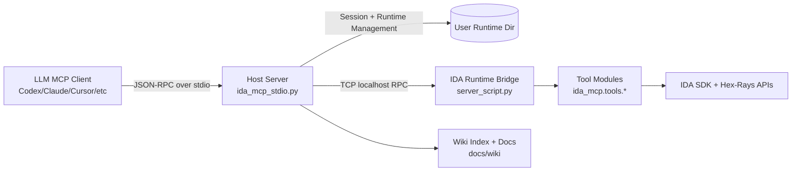
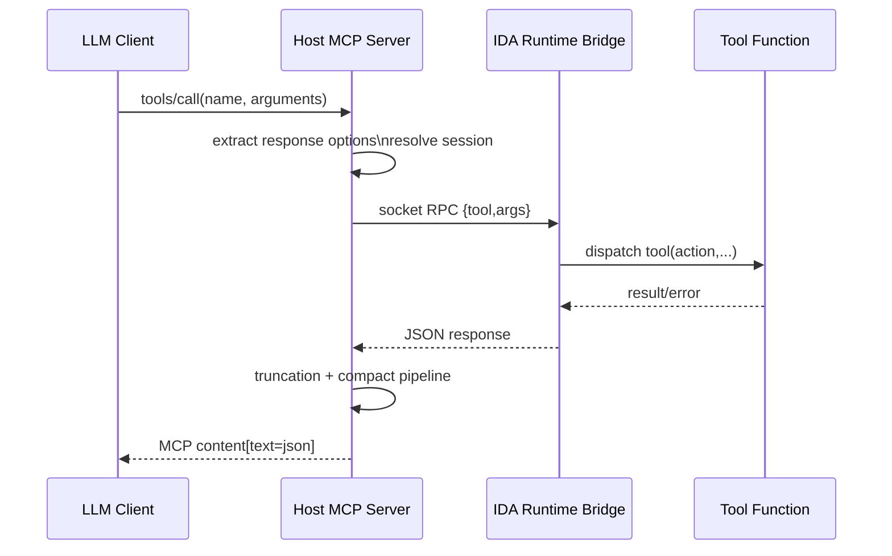
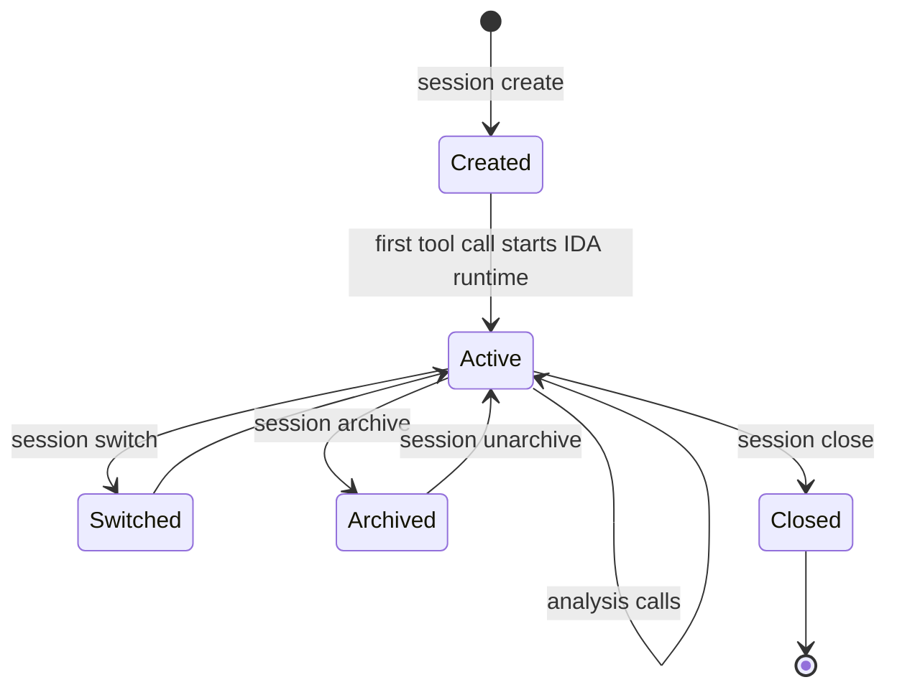

# IDA Pro MCP

Deterministic and ML-powered reverse engineering for IDA Pro via MCP.

`ida-pro-mcp` exposes IDA analysis, decompilation, debugging, triage, and annotation as MCP tools so coding agents can operate on binaries with structured calls instead of fragile text scraping.

## Table Of Contents

- [What This Project Is](#what-this-project-is)
- [Why LLM Agents Use It](#why-llm-agents-use-it)
- [Requirements](#requirements)
- [Install](#install)
- [Documentation Map](#documentation-map)
- [Skillized Tool Catalog](#skillized-tool-catalog)
- [Quick Start](#quick-start)
- [How LLMs Should Use It](#how-llms-should-use-it)
- [Architecture Graphs](#architecture-graphs)
- [Tool Surface](#tool-surface)
- [Technical Deep Dive](#technical-deep-dive)
- [Linux Support Details](#linux-support-details)
- [Response And Context Controls](#response-and-context-controls)
- [Troubleshooting](#troubleshooting)
- [Development](#development)

## What This Project Is

`ida-pro-mcp` is a session-oriented MCP server built for IDA Pro 9.2+.

It provides:

- A host MCP server (`ida_mcp_stdio.py`) that LLM clients talk to
- A runtime bridge inside IDA (`src/ida_pro_mcp/server_script.py`)
- 60+ analysis tools under `src/ida_pro_mcp/ida_mcp/tools/`
- Persistent session/bookmark metadata in user runtime directory (`IDA_MCP_CACHE_DIR` or OS default)
- Built-in wiki docs accessible through the `wiki` tool

The design goal is simple: make binary analysis stable, scriptable, and token-efficient for MCP clients.

Important architecture note:

- This project does **not** run any backend cloud LLM service.
- Tool execution is deterministic IDA SDK logic plus local/statistical ML components where implemented (for example C2 scoring and ranking components).
- Any LLM behavior comes from the MCP client using this server, not from an embedded server-side LLM runtime.

## Why LLM Agents Use It

Without MCP, an LLM has to infer analysis state from screenshots, logs, and pasted snippets.
With `ida-pro-mcp`, an LLM can:

- Open and reuse long-lived analysis sessions
- Query exact symbols, xrefs, decompilation, CFG, imports, strings, types
- Perform edits (rename/comment/patch/type changes) reproducibly
- Batch operations to reduce round trips
- Receive compact-by-default responses to preserve context window

## Requirements

- IDA Pro `9.2+`
- Python `3.11+`
- `uv` recommended (installer supports fallback without `uv`)

## Install

### One-command installer (recommended)

```bash
python install.py
```

Installer behavior:

1. Relocates/updates to a stable install directory.
2. Creates `.venv` and installs dependencies.
3. Auto-detects IDA install path (`IDADIR`/`IDA_MCP_IDAT` fallback logic included).
4. Configures supported MCP clients.
5. Installs Codex skills into `CODEX_HOME/skills` (default `~/.codex/skills`) with `router` mode by default (single skill, minimal context).
6. Sets wiki path automatically when available.
7. Sets `IDA_MCP_MONOLITHIC_TOOL_DESCRIPTIONS=1` and `IDA_MCP_TOOLS_LIST_MODE=full` so MCP clients receive full tool descriptions and schemas directly.

Default install directory:

- Windows: `%LOCALAPPDATA%/ida-pro-mcp`
- Linux/macOS: `~/.local/share/ida-pro-mcp`

### Supported MCP clients auto-configured by installer

- Gemini CLI
- Antigravity
- Claude Code
- Codex
- Copilot CLI
- OpenCode
- Claude Desktop
- Cursor
- VS Code (Copilot MCP config)
- Windsurf
- Cline
- Roo Code

### Manual run (for development)

```bash
python -u ida_mcp_stdio.py
```

## Documentation Map

Primary documentation now lives under `docs/`:

- `docs/README.md`: entry point for docs organization.
- `docs/wiki/`: wiki content used by the `wiki` MCP tool.
- `docs/TECHNICAL_REFERENCE.md`: low-level technical details.
- `docs/TOOLS_REFERENCE.md`: tool-focused reference.

Legacy/superseded notes were moved to `docs/legacy/` to keep repo root clean.

## Skillized Tool Catalog

To reduce prompt/context churn from large tool metadata blocks, this repo uses a router-plus-docs layout:

- Root: `.agents/skills/`
- Router skill (only skill by default): `.agents/skills/ida-tool-router/SKILL.md`
- Per-tool docs (not skills, loaded on demand): `.agents/tool-docs/ida-tool-<tool>.md`

Installer skill modes:

- `router` (default): install only `ida-tool-router` (best for context efficiency)
- `full`: install every skill directory under `.agents/skills`
- `none`: skip Codex skill installation

Regenerate after tool metadata changes:

```bash
python3 scripts/generate_tool_skills.py
```

Source of truth for generation:

- `TOOL_DESCRIPTIONS`
- `TOOL_ACTIONS`
- `TOOL_ARG_SCHEMAS`

all in `ida_mcp_stdio.py`.

## Quick Start

### 1) Start server

Use installer-managed client config, or run manually:

```bash
python -u ida_mcp_stdio.py
```

### 2) Create a session

From your MCP client:

```json
{
  "name": "session",
  "arguments": {
    "action": "create",
    "binary_path": "/path/to/binary"
  }
}
```

### 3) Call tools without repeating `idb`

IDB is **not required** to run MCP. Once a session is active, most tools automatically use current session context.
If you pass `idb`, it can be a session ID (`AB12CD34`), a `SID_*` IDB identifier/name, a binary path, or a full IDB path.

```json
{
  "name": "data",
  "arguments": {
    "action": "functions",
    "count": 50
  }
}
```

### 4) Use batch for multi-step flows

```json
{
  "name": "batch",
  "arguments": {
    "calls": [
      {"name": "idb", "arguments": {"action": "meta"}},
      {"name": "data", "arguments": {"action": "imports"}},
      {"name": "search", "arguments": {"action": "strings", "pattern": "http"}}
    ]
  }
}
```

Shorthand is also supported to reduce bracket noise:

```json
{
  "name": "batch",
  "arguments": {
    "calls": [
      "idb:meta",
      {"name": "data", "action": "imports"},
      {"tool": "search", "action": "strings", "pattern": "http"}
    ]
  }
}
```

## How LLMs Should Use It

Recommended operating pattern for agents:

1. `session(action="create"|"switch")`
2. `idb(action="meta")` for initial grounding
3. `data/code/search` for discovery
4. `summarize/agent/classify` for high-level synthesis
5. `modify/edit/bulk` for controlled updates
6. `bookmarks/wiki` for durable notes and in-tool docs

Practical agent rules:

- Prefer compact results, then zoom in with filters.
- Use `batch` when the next calls are deterministic.
- Paginate large result sets with tool-level `offset`/`count`.
- Use `truncation(action="continue")` only when needed.
- Save milestones via bookmarks and session notes.

## Architecture Graphs

### High-level architecture



### Tool call sequence



### Session lifecycle



## Tool Surface

The advertised `tools/list` surface is intentionally compact (~30 core tools) for limited context windows.
Additional specialized capabilities remain accessible via hub tools + wiki docs.

- Core/session: `session`, `batch`, `bookmarks`, `wiki`, `truncation`
- Data access: `idb`, `data`, `code`, `search`, `types`, `memory`
- Editing: `modify`, `funcs`, `segments`, `bulk`, `edit`, `annotation`, `comments_ai`
- Analysis: `cfg_analysis`, `xref_analysis`, `stack_analysis`, `abi`, `protocol`, `classify`, `compare`, `summarize`, `agent`
- Security RE: `vuln_scan`, `taint`, `gadgets`, `deobfuscate`, `crypto_id`, `c2_detect`, `yara_hunt`
- Debug/trace: `debug`, `trace`, `trace_analysis`, `coverage`
- Structural: `ctree`, `microcode`, `graph`, `structs`, `imports_deep`, `symbols`, `patterns`
- Utilities: `analysis`, `project`, `export`, `history`, `misc`, `calc`, `llm_helpers`, `binary_info`, `string_ops`

For detailed per-tool docs, use the `wiki` tool or browse `docs/wiki/tools/`.

### `vuln_scan` modes (local + OSV)

`vuln_scan` now supports both:

- Local static heuristics (buffer overflow, format string, command injection, etc.)
- Public OSV lookups for package-version vulnerability intelligence

Useful actions:

- `scan_all`: aggregate all local scanners, optionally enriched with OSV
- `osv_query`: OSV-only package vulnerability query
- `classify`: classify one function/address context against scanner signatures

OSV coordinates accepted:

- `ecosystem:name@version` (recommended), e.g. `PyPI:requests@2.19.0`
- `pkg:purl` format, e.g. `pkg:npm/lodash@4.17.20`

Example calls:

```json
{
  "name": "vuln_scan",
  "arguments": {
    "action": "osv_query",
    "osv_coordinates": ["PyPI:requests@2.19.0", "npm:lodash@4.17.20"]
  }
}
```

```json
{
  "name": "vuln_scan",
  "arguments": {
    "action": "scan_all",
    "limit": 80,
    "severity": "high",
    "osv_coordinates": ["PyPI:requests@2.19.0"]
  }
}
```

`vuln_scan` responses include compact `findings` plus structured `items`, with `count/total/offset/truncated` and summary buckets (`severity_counts`, `type_counts`).

## Technical Deep Dive

### 1) Process model and transport

There are two layers:

- Host layer (`ida_mcp_stdio.py`): MCP JSON-RPC over stdio
- IDA runtime layer (`server_script.py`): local TCP socket RPC into IDA process

Why split it this way:

- Host stays responsive and can manage sessions/process recovery.
- Runtime runs inside IDA context and calls IDA SDK safely.
- Crashes or hangs are isolated per runtime process/session.

### 2) Session manager internals

Session metadata is persisted under runtime storage:

- `<runtime>/sessions/SID_<ID>_metadata.json`
- `<runtime>/sessions/SID_<ID>_bookmarks.json`

Runtime directory resolution:

- `IDA_MCP_CACHE_DIR` (preferred override)
- `IDA_MCP_DATA_DIR` (legacy override)
- Windows default: `%LOCALAPPDATA%/ida-pro-mcp`
- macOS default: `~/Library/Application Support/ida-pro-mcp`
- Linux default: `$XDG_STATE_HOME/ida-pro-mcp` or `~/.local/state/ida-pro-mcp`

Key properties tracked:

- `session_id`, `binary_path`, `idb_path`
- analysis options and whether they were applied
- tags, notes, access timestamps
- runtime state (resolved at query time)

The host can auto-recover sessions from orphaned `SID_*.i64/.idb` files even if metadata was missing.

### 3) Runtime startup and recovery

For each active session, host:

1. Finds/starts `idat` binary.
2. Starts bridge script in headless mode.
3. Waits for ping readiness on dynamic local port.
4. Applies requested analysis/loader/arch options.
5. Monitors process health and performs restart/recovery when needed.

Recovery logic handles known bad states (for example corrupt/stale IDB artifacts) and can rebuild from binary when possible.

### 4) Dispatch pipeline

At call time:

1. Tool name canonicalization (including aliases).
2. Session routing (`idb` implicit from active session when omitted).
3. Runtime RPC call.
4. Tool execution in IDA runtime.
5. Host truncation and response compaction.
6. Final MCP response serialization.

Normalization hardening (host-side) now aggressively tolerates noisy LLM call formats for
`threat_hunt`, `search`, `session`, and `code`:

- wrapped or malformed action tokens (for example `[disasm]`, `"compatibility"`, `action:regexp`)
- noisy argument keys (for example `[address]`, `targets`, `id`, `source_tool`)
- bracketed/scalar/list-like values (for example `[0x401000]`, `[0x401000,0x401010]`)

Canonical action/argument names are still preferred, but these variants are now normalized
before routing whenever unambiguous.

### 5) Context-optimized response pipeline

As of current implementation, compact mode is default.

Host now performs global compaction before sending content:

- Drops low-value boilerplate (for example redundant `ok: true`)
- Deduplicates pagination counters when implied
- Trims large metadata/error fields
- Supports top-level field projection and omission
- Supports compact batch envelope mode
- Supports optional list-of-object table compaction
- Uses minified JSON serialization by default

Full verbose shape is still available via explicit `response_mode=full`.

Every tool response now also carries:

- `llm_pointer_note` (ALL CAPS): reminder to avoid mental pointer/address arithmetic and use
  `calc` / `memory` tooling instead.

### 6) Wiki subsystem

The `wiki` tool indexes markdown content from `docs/wiki` (or `IDA_MCP_WIKI_DIR`) and supports:

- topic listing
- fuzzy/strict search
- section-aware reads
- snippet extraction
- related topic discovery
- fallback generation for tool docs when static docs are absent

This gives agents in-band documentation without leaving MCP context.

## Linux Support Details

Linux is a first-class path in installer and runtime logic.

### IDA detection order

1. `IDADIR` / `IDA_DIR`
2. `IDA_MCP_IDAT`
3. common install globs (`/opt`, `/usr/local`, user home patterns)
4. `PATH` lookup (`idat64`, `idat`, `ida64`, `ida`)

### Linux client config locations handled

- Codex: `~/.codex/config.toml`
- Cursor: `~/.cursor/mcp.json`
- VS Code MCP (Copilot storage path under XDG)
- Claude Desktop under XDG config
- Cline/Roo under XDG config
- OpenCode and Copilot CLI config paths under XDG-aware logic

Installer can repair and overwrite broken/stale entries for legacy names and stale command paths.

## Response And Context Controls

Per-call response controls supported by host:

- `_response_mode`: `compact` or `full`
- `_compact`: boolean shorthand
- `_response_fields`: include only selected top-level fields
- `_response_omit`: remove selected top-level fields
- `_response_max_items`: cap list items
- `_response_max_string`: cap string size
- `_response_char_budget`: trigger truncation middleware budget
- `_response_table`: optional table compaction for repeated object rows
- `_response_batch_compact`: compact `batch` envelopes
- `_error_details`: `none|basic|full`
- `_qol_mode`: `tiny|balanced|debug` preset profile

Global action wrappers (all action-based tools):
- `action="grep"`: run `source_action`, then grep line output.
- `action="pick"`: run `source_action`, then keep top-level fields from `pick_fields`.
- `action="head"` / `action="tail"`: run `source_action`, then keep first/last N rows.
- `action="stats"`: run `source_action`, return payload statistics.
- `action="next"`: continue paginated output using `next_token` (also accepts `token`/`cursor`).

Environment defaults:

- `IDA_MCP_RESPONSE_MODE`
- `IDA_MCP_QOL_MODE` (`balanced` default)
- `IDA_MCP_TOOLS_LIST_MODE` (`full` default)
- `IDA_MCP_ERROR_DETAIL_LEVEL`
- `IDA_MCP_BATCH_COMPACT`
- `IDA_MCP_TABLE_COMPACT`
- `IDA_MCP_COMPACT_MAX_ITEMS`
- `IDA_MCP_COMPACT_MAX_STRING`
- `IDA_MCP_COMPACT_CHAR_BUDGET`
- `IDA_MCP_TRUNCATE_TOKENS`
- `IDA_MCP_WIKI_DEFAULT_LIMIT`
- `IDA_MCP_MONOLITHIC_TOOL_DESCRIPTIONS` (`1` default full verbose tool metadata)
- `IDA_MCP_POINTER_NOTE_INTERVAL` (seconds; default `900`)
- `IDA_MCP_POINTER_NOTE_MIN_SIGNAL` (usage signal threshold before showing note; default `3`)

`tools/list` mode behavior:
- `ultra`: tiny wiki-first descriptions + minimal schema (`action` enum and optional `idb` reference).
- `lean`: shortened per-tool descriptions + compact parameter typing.
- `full` (default): full descriptions and full input schema.

`tools/list` also supports metadata shaping params:
- `prefix`, `contains`, `category` filters
- `sort` (`name` or `category`) and `descending`
- `offset` + `limit` pagination (`next_offset` returned when more results exist)

Installer defaults now bias for direct schema-rich tool loading:
- `IDA_MCP_RESPONSE_MODE=compact`
- `IDA_MCP_QOL_MODE=balanced`
- `IDA_MCP_TOOLS_LIST_MODE=full`
- `IDA_MCP_MONOLITHIC_TOOL_DESCRIPTIONS=1`
- `IDA_MCP_SMART_MATCH_MODE=balanced` (`off|conservative|balanced|aggressive`)
- `IDA_MCP_BATCH_COMPACT=1`
- `IDA_MCP_COMPACT_MAX_ITEMS=48`
- `IDA_MCP_COMPACT_MAX_STRING=1400`
- `IDA_MCP_COMPACT_CHAR_BUDGET=30000`
- `IDA_MCP_TRUNCATE_TOKENS=2000`
- `IDA_MCP_WIKI_DEFAULT_LIMIT=140`

Session QoL additions:
- Session macros: `macro_set`, `macro_get`, `macro_list`, `macro_delete`, `macro_run`.
- Resume context quickly with `session(action="recent_workset")`.
- Tool-call activity is captured in-memory and merged with session bookmarks for workset output.

## Troubleshooting

### "Tool not found"

- Run `tools/list` to confirm advertised surface.
- Check for alias/canonical naming mismatch.
- Verify runtime tool module exists under `src/ida_pro_mcp/ida_mcp/tools/`.

### "Debugger not running" during dynamic flows

- Ensure target is actually started/suspended in the same active session.
- Retry after `debug(action="start")` returns and session runtime is active.

### Permission/path errors on exports

- Pass explicit writable `path` in `export` calls.
- Verify session cache directory is writable.

### Installer appears to do nothing

- Re-run installer from project root.
- Check resulting install directory and generated client config files.
- Confirm client points to relocated `.venv` python and `ida_mcp_stdio.py`.

## Development

Run targeted tests:

```bash
python -m unittest tests.test_host_wiki_and_hardening
python -m unittest tests.test_linux_support
python -m unittest tests.test_session_features
```

Generate noisy-argument/action acceptance corpus (10k+ cases; current default flow emits 20k):

```bash
python scripts/generate_arg_action_variations.py \
  --max-cases-per-tool 5000 \
  --min-total-cases 10000 \
  --output tests/artifacts/arg_action_variations.json
```

Manual client probing:

```bash
python tests/test_mcp_client.py --tool idb --args "action=meta"
```

## License

MIT (see `LICENSE`).
